# 1.6-rebuild

## What is 1.6-rebuild?
1.6-rebuild is a continuation of Vector firmware 1.6, 1.6 is considered to be the best Vector firmware version because it's the last version made by anki and has a higher activity level compared to other later firmware versions. However it isn't perfect, with 1.6 being older it has more bugs compared to newer firmwares and is missing out on some features. This is where I came in, since late July of 2025 I've been working on porting features from newer Vector firmwares such as 1.8's custom eye colors and 2.0's Vector 2.0 support over to 1.6 while making sure to keep the charm of 1.6.

## Sounds great, what are the changes you've made?
You can find all the changes I've made over in [CHANGES.md](/CHANGES.md)

## How can I install it?
1.6-rebuild is installable via froggitti's web setup at [https://websetup.froggitti.net/](https://websetup.froggitti.net/). Steps are as follows:

0. - (Optional) Unlock your robot via [https://unlock-prod.froggitti.net/](https://unlock-prod.froggitti.net/). (You can skip this if you've already unlocked or would prefer not to unlock your robot)

1. - Put your robot into recovery mode by putting Vector on the charger and holding the backpack button until Vector's lights turn back on. (You'll know Vector is in recovery when you see anki.com/v, ddl.io/v, anki.com/dev or u.p-2.xyz on Vector's screen)

2. - Go to [https://websetup.froggitti.net/](https://websetup.froggitti.net/) and select the option that says "CUSTOM FIRMWARE" in the stack. (Note for prod users, use [https://anki2.ca/1.6-prod/](https://anki2.ca/1.6-prod/) to install the ota)
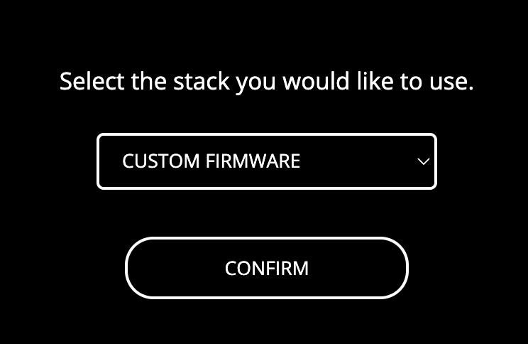

3. - Double click the back button so Vector shows the key screen and then connect your robot using the button that says "PAIR WITH VECTOR".
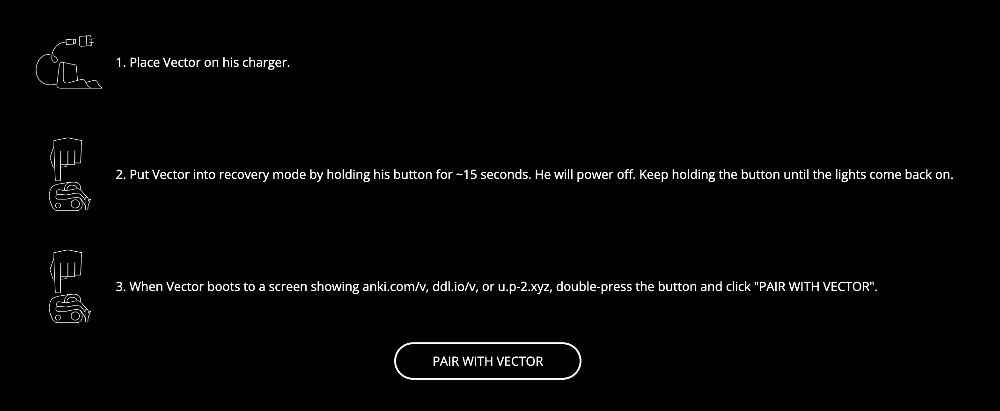

4. - Choose the robot id that matches your robot in the list that shows up.
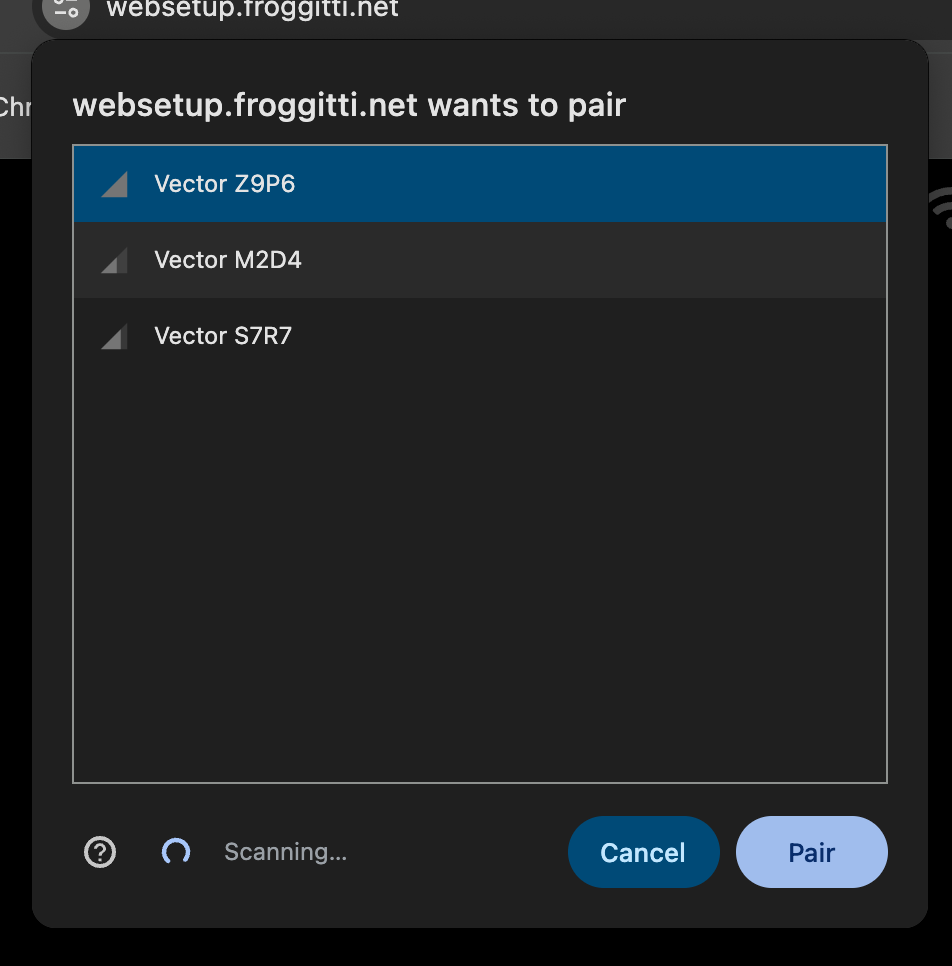

5. - Enter the pin that shows up on Vector's screen into the box, keep auto setup flow enabled.
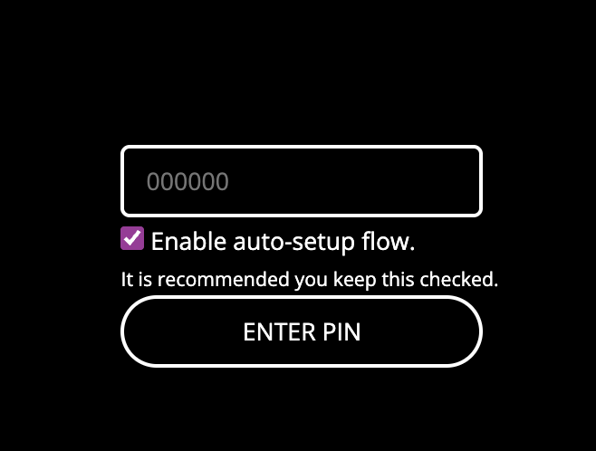

6. - Select the 1.6-rebuild version in the list that matches with your bot type, if unlocked prod, pick any, if locked prod, choose prod, if oskr, choose oskr, if anki dev, choose dev.

7. - Let it install and wait for Vector to reboot, once you see the V boot anim you know Vector is on 1.6-rebuild

## How can I connect Vector to the custom server environment
Once Vector is booted up follow these steps to connect him to the server

1. - Place Vector onto the charger.
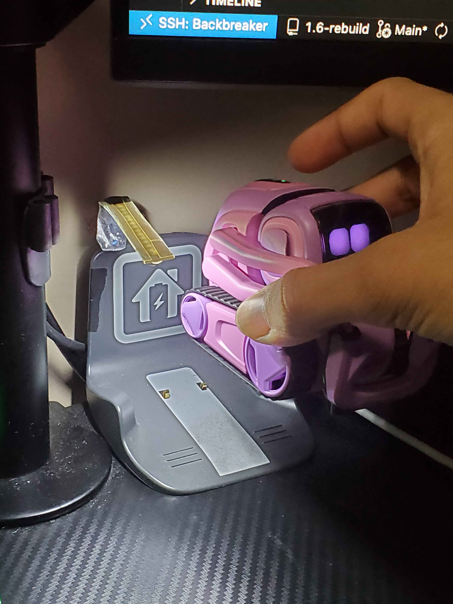

2. - Double click Vector's back button so the key icon shows on the screen.
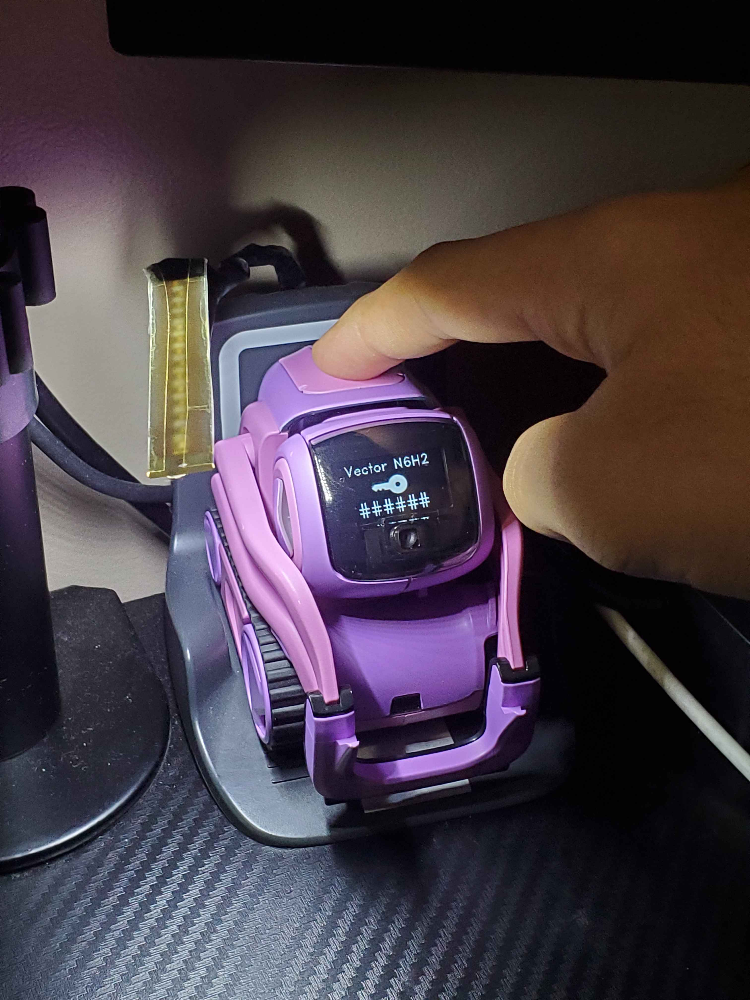

3. - Move the lift up and down to enter CCIS.
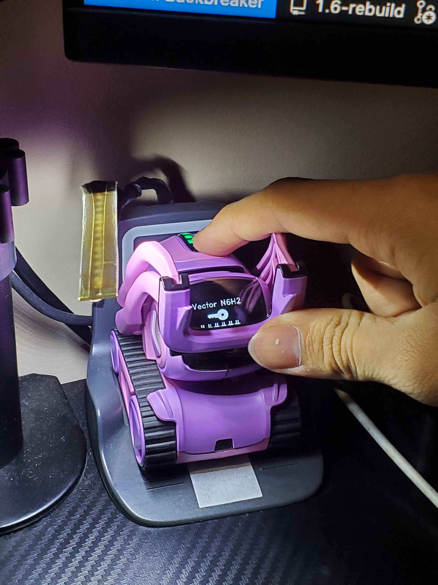
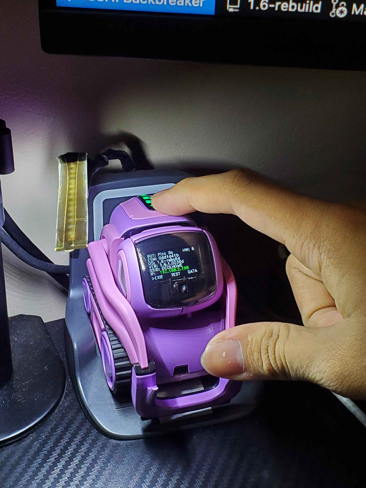

4. - Use one of the wheels to scroll to the option that says `DATA OPTIONS` on Vector 1.0 and `DATA` on Vector 2.0 and move the lift up and down to select it.
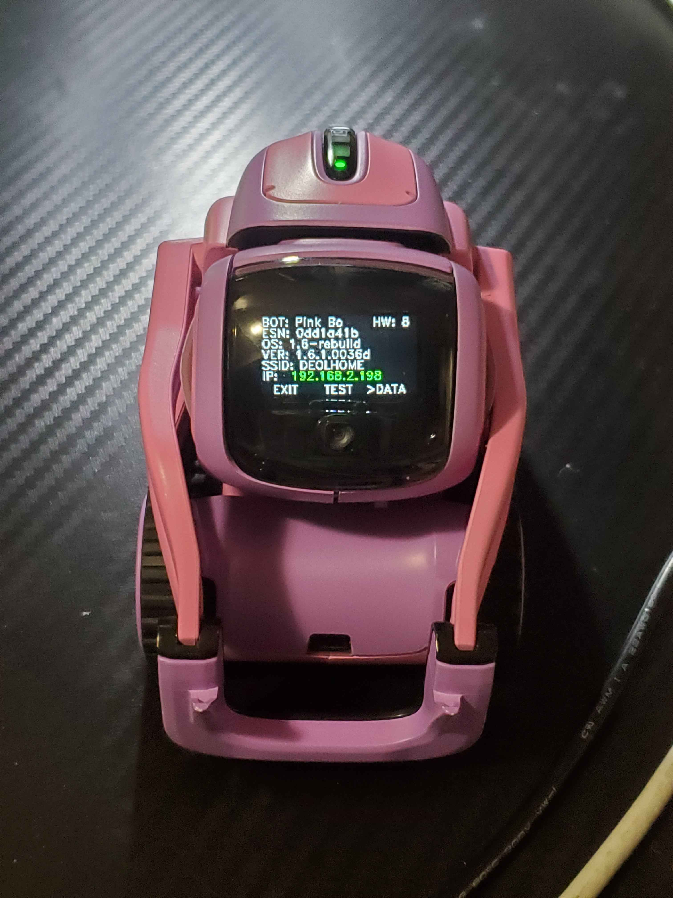

5. - Use one of the wheels to select `REONBOARD` and move the lift up and down to select it. This will not clear user data.
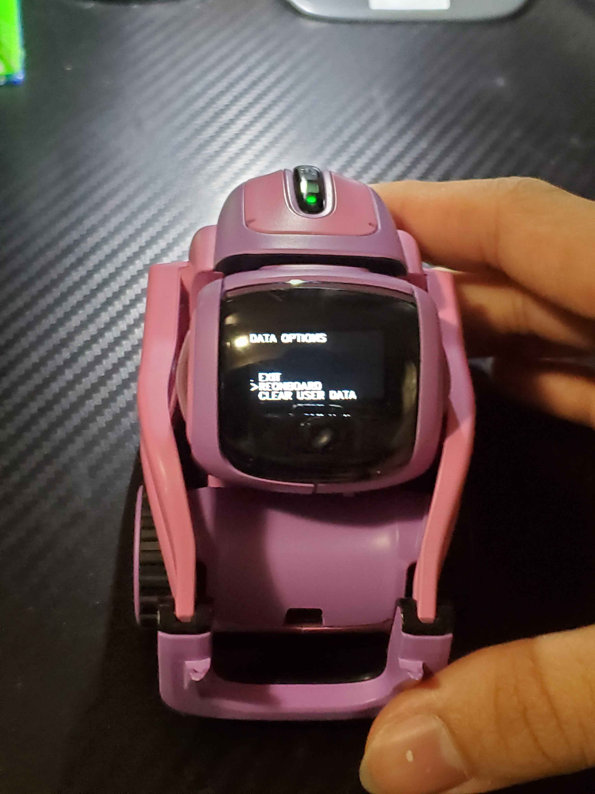

6. - Use one of the wheels to scroll to `CONFIRM` and move the lift up and down to select it.
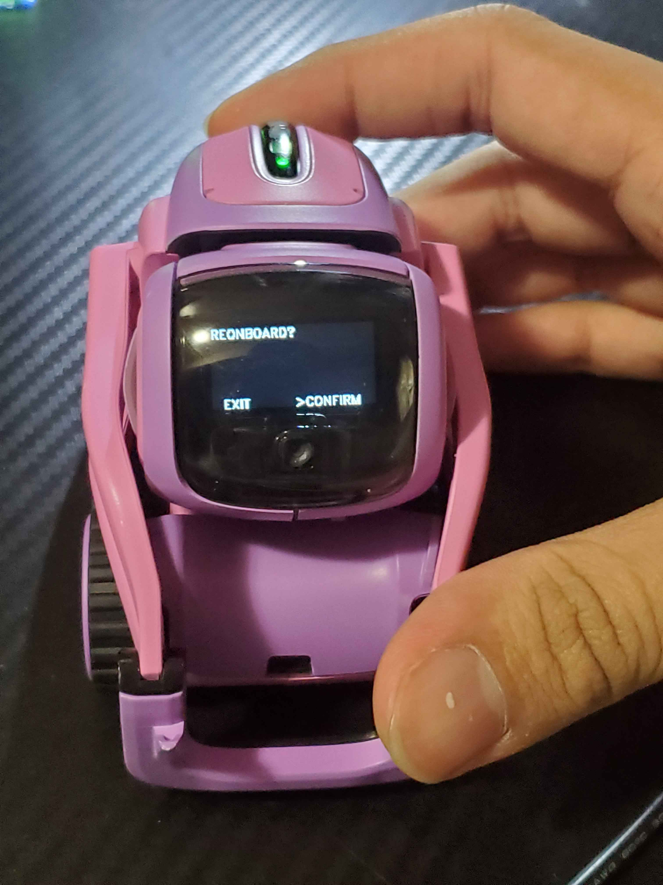

7. - Wait for Vector to reboot.

8. - Once Vector reboots go to [https://anki2.ca/1.6/](https://anki2.ca/1.6/) to setup with the server, follow the steps on the website.
  
## Hey I found a bug, what should I do?
Make a bug report at [https://github.com/Victor-Rebuild/victor-1.6-rebuild/issues](https://github.com/Victor-Rebuild/victor-1.6-rebuild/issues) and I'll get to it when I get time.

## I got a complaint and would like to voice my opinion loudly and not in a civil manner.
Talk is cheap, send patches. [https://github.com/Victor-Rebuild/victor-1.6-rebuild/pulls](https://github.com/Victor-Rebuild/victor-1.6-rebuild/pulls)
